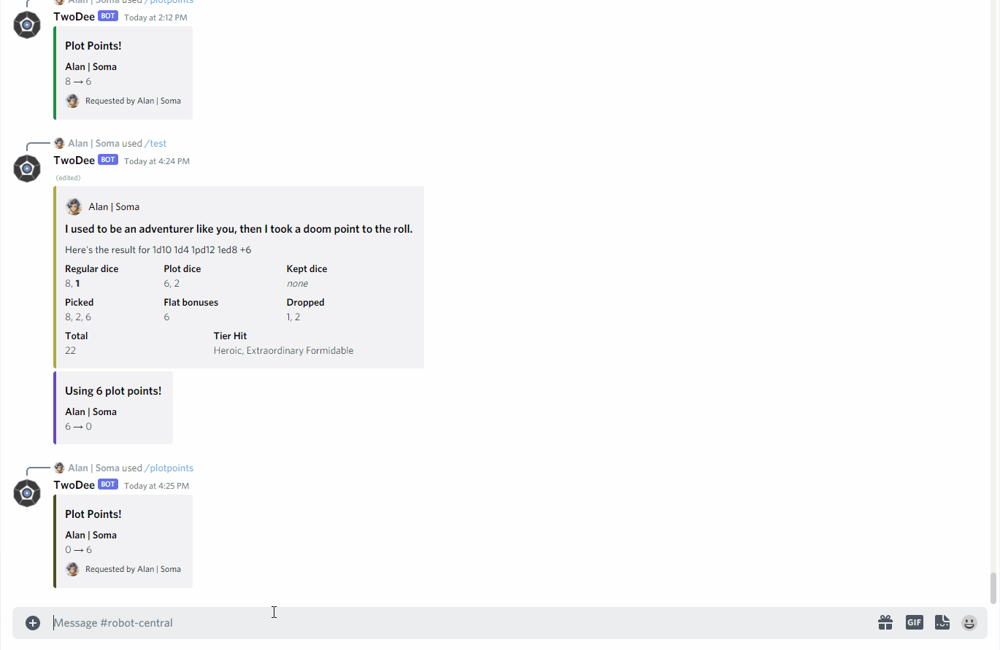
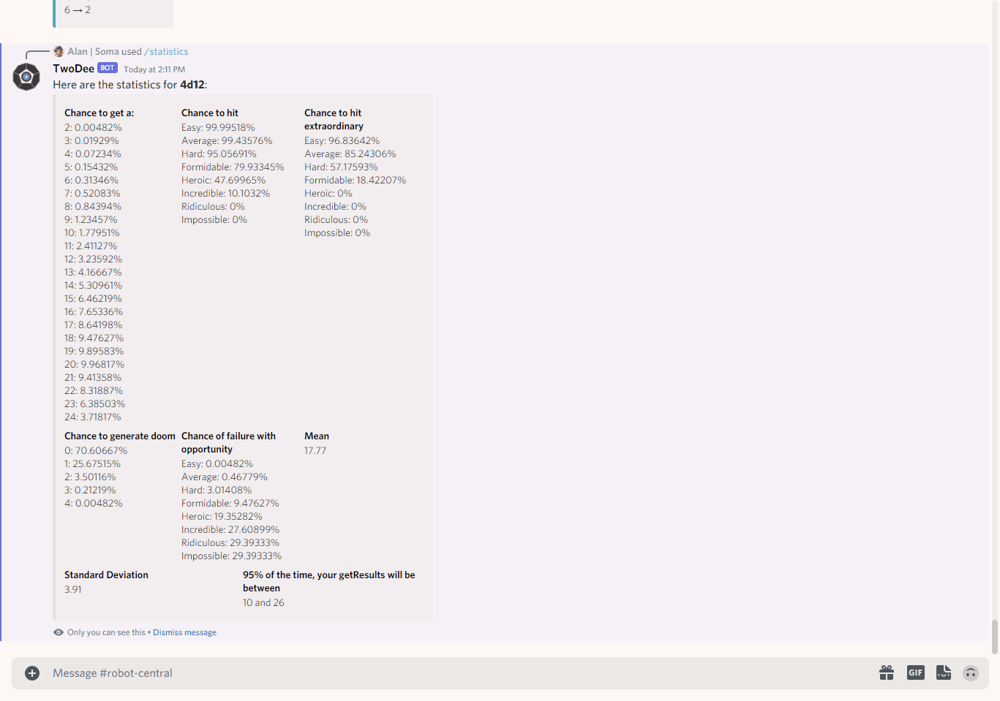

[comment]: <> (TODO Expand about section, add images, add roadmap)

[![Contributors][contributors-shield]][contributors-url]
[![Forks][forks-shield]][forks-url]
[![Stargazers][stars-shield]][stars-url]
[![Issues][issues-shield]][issues-url]
[![MIT License][license-shield]][license-url]
[![LinkedIn][linkedin-shield]][linkedin-url]


<h1 align="center">Welcome to TwoDee 👋</h1>

### 🏠 [Homepage](https://github.com/Alan19/TwoDee)

> TwoDee is a Discord bot for the Facets tabletop RPG ruleset, a homebrew ruleset inspired by [Cortex](https://www.cortexrpg.com/). It handles dice rolls, character sheet automation, and game state tracking all within Discord so you don't have to track them yourself.

## About the Project

The Facets ruleset uses a custom method of calculating the dice rolls, where the outcome of a roll is calculated by
rolling a pool of dice, and choosing the two highest dice rolls (with some exceptions). Because not many dice statistics
calculation systems support this without extensive tweaks, as well as the system having mechanics where you can choose
the top three dice instead of two, I decided to make a program that would calculate the statistics of dice rolls. Over
time, I added features such as character sheet automation in order to decrease the amount of time spent updating
spreadsheets so more time can be spent adventuring and doing ~~stupid~~ cool things in the game.

## Install

To get a local copy up and running follow these steps.

### Prerequisites

* Gradle
* Java

### Installation

1. Get a bot token from [Discord](https://discordapp.com/developers/applications/). **Do not share this with anyone!**
2. Clone the repo
   ```sh
    https://github.com/Alan19/TwoDee.git
    ```
3. Set up the `resources` folder
    1. Create a file named `announcement_channels.txt` and add the channel IDs of each channel that you want the bot to
       send a startup message to
       #### Example `announcement_channels.txt` file
        ```
       9084021907123
       2198487129038
       ```
    2. In the `bot.properties` file, paste the token you have obtained from Discord after the equals sign in the token
       field
    3. Create a file named `storytellers.json` and create a JSON array containing the role IDs for storytellers (
       Storytellers are the Facets equivalent of GMs or DMs)
       #### Example `storytellers.json` file
       ```json
       [
         123498903812,
         129321390521
       ]
       ```

### Adding Google Sheets integration

1. Download Google Drive API token
2. Fill out `players.json`. The file should contain a JSON array containing objects that contain the Discord ID and the
   Sheet ID of the players.
   #### Example `players.json` file
   ```json
   [
      {
        "discord_id": 707906577071579042,
        "sheet_id": "26dPTBrNsoScoAmsqCz026dPTBrNsoScoAmsqCz0"
      }
   ]
   ```

## Usage

You can run the bot with the following command

```sh
gradle run
```

*For examples of available commands, please refer to
the [documentation](https://github.com/Alan19/TwoDee/wiki/Bot-Commands)*

### Demo





### Inviting the bot to your server

On startup, the bot will print its invite link in the console. Use that link to invite the bot to servers you are in.

### Google Sheets

If this is the first time you have started the bot after adding Google Sheets integration, your browser automatically
open and send you to a page to authenticate your Google account. Once you do so, it will create a `tokens` folder in the
root directory of your project and download a `StoredCredential` file.

**Do not share the `credentials.json` file or the `StoredCredential` files!**

## Roadmap

See the [open issues](https://github.com/Alan19/TwoDee/issues) for a list of proposed features (and known issues).

**Some cool features coming in the near future include**:

* Settings consolidation
* Removal of hardcoded IDs
* Damage calculation command
* Dice roll difficulty helper

## Author

👤 **Alan Xiao**

* Github: [@Alan19](https://github.com/Alan19)
* LinkedIn: [@alan-xiao1](https://www.linkedin.com/in/alan-xiao1/)

## Contributors

👤 **Skylar Sommers**

* Github: [@SkySom](https://github.com/SkySom)

👤 **Lance**

* Github: [@Lance5057](https://github.com/Lance5057)

👤 **Andrew Sage**

* Github: [@belathus](https://github.com/belathus)

👤 **_0Steven**

* Github: [@00-Steven](https://github.com/00-Steven)

## 🤝 Contributing

Contributions, issues and feature requests are welcome!<br />Feel free to
check [issues page](https://github.com/Alan19/TwoDee/issues).

## Show your support

Give a ⭐️ if this project helped you!

## 📝 License

Copyright © 2021 [Alan19](https://github.com/Alan19). <br/>
This project is [MIT](https://github.com/Alan19/TwoDee/blob/master/LICENSE) licensed.

***
_This README was generated with ❤️ by [readme-md-generator](https://github.com/kefranabg/readme-md-generator)_


<!-- MARKDOWN LINKS & IMAGES -->
<!-- https://www.markdownguide.org/basic-syntax/#reference-style-links -->

[contributors-shield]: https://img.shields.io/github/contributors/Alan19/TwoDee.svg?style=for-the-badge

[contributors-url]: https://github.com/Alan19/TwoDee/graphs/contributors

[forks-shield]: https://img.shields.io/github/forks/Alan19/TwoDee.svg?style=for-the-badge

[forks-url]: https://github.com/Alan19/TwoDee/network/members

[stars-shield]: https://img.shields.io/github/stars/Alan19/TwoDee.svg?style=for-the-badge

[stars-url]: https://github.com/Alan19/TwoDee/stargazers

[issues-shield]: https://img.shields.io/github/issues/Alan19/TwoDee.svg?style=for-the-badge

[issues-url]: https://github.com/Alan19/TwoDee/issues

[license-shield]: https://img.shields.io/github/license/Alan19/TwoDee.svg?style=for-the-badge

[license-url]: https://github.com/Alan19/TwoDee/blob/master/LICENSE.txt

[linkedin-shield]: https://img.shields.io/badge/-LinkedIn-black.svg?style=for-the-badge&logo=linkedin&colorB=555

[linkedin-url]: https://www.linkedin.com/in/alan-xiao1/

[product-screenshot]: images/icon.png